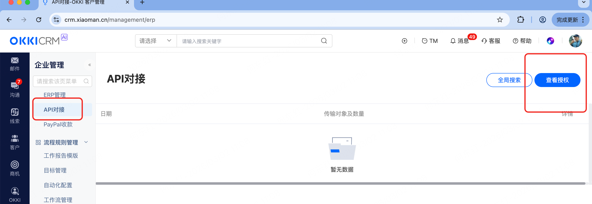

# 快速开始

# 开通API对接功能
使用小满Open API对接之前，需要开通API对接功能。
查看是否已开通API对接功能：登录小满主账号，进入企业管理 → 外部对接 → API对接（查看client_id和client_secret）





协议:https
正式域名:https://api-sandbox.xiaoman.cn
编码：UTF-8
连接超时时间:60s
响应超时时间:60s

# 对接指引与常见QA
[多系统对接指引](../external/yuque/nl97i50gpoc4dbeg.md)

[常见问题](../external/yuque/mwnvlommqa5q5u9y.md)

# 注意

1、目前API访问不会对IP进行黑名单管控，若出现访问不了api-sandbox.xiaoman.cn的情况，请检查网络
```
    ping api-sandbox.xiaoman.cn
```
